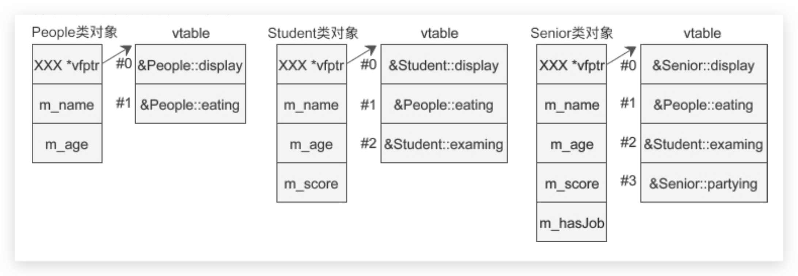
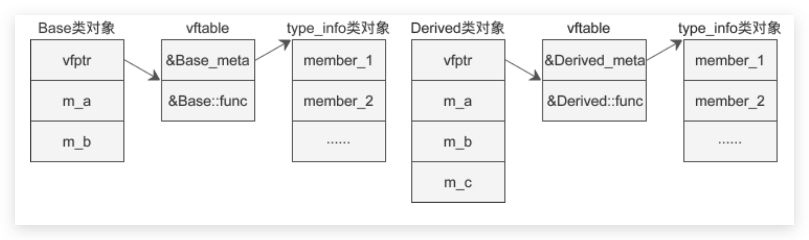

# 多态和虚函数

## 虚函数

1. 通过基类指针只能访问派生类的成员变量，但是不能访问派生类的成员函数。

2. 有了虚函数，基类指针指向基类对象时就使用基类的成员（包括成员函数和成员变量），指向派生类对象时就使用派生类的成员。换句话说，基类指针可以按照基类的方式来做事，也可以按照派生类的方式来做事，它有多种形态，或者说有多种表现方式，我们将这种现象称为多态（Polymorphism）。C++提供多态的目的是：可以通过基类指针对所有派生类（包括直接派生和间接派生）的成员变量和成员函数进行“全方位”的访问，尤其是成员函数。如果没有多态，我们只能访问成员变量。

```C++
#include <iostream>
using namespace std;

//基类People
class People{
public:
    People(char *name, int age);
    virtual void display();  //声明为虚函数
protected:
    char *m_name;
    int m_age;
};
People::People(char *name, int age): m_name(name), m_age(age){}
void People::display(){
    cout<<m_name<<"今年"<<m_age<<"岁了，是个无业游民。"<<endl;
}

//派生类Teacher
class Teacher: public People{
public:
    Teacher(char *name, int age, int salary);
    virtual void display();  //声明为虚函数
private:
    int m_salary;
};
Teacher::Teacher(char *name, int age, int salary): People(name, age), m_salary(salary){}
void Teacher::display(){
    cout<<m_name<<"今年"<<m_age<<"岁了，是一名教师，每月有"<<m_salary<<"元的收入。"<<endl;
}

int main(){
    People *p = new People("王志刚", 23);
    p -> display();

    p = new Teacher("赵宏佳", 45, 8200);
    p -> display();

    return 0;
}
```

## 虚函数注意事项以及构成多态的条件

1. 只需要在虚函数的声明处加上 virtual 关键字，函数定义处可以加也可以不加。

2. 为了方便，你可以只将基类中的函数声明为虚函数，这样所有派生类中具有遮蔽关系的同名函数都将自动成为虚函数。

3. 当在基类中定义了虚函数时，如果派生类没有定义新的函数来遮蔽此函数，那么将使用基类的虚函数。派生类中的成员（包括成员变量和成员函数）和基类中的成员重名，那么就会遮蔽从基类继承过来的成员

4. 只有派生类的虚函数覆盖基类的虚函数（函数原型相同）才能构成多态（通过基类指针访问派生类函数）。例如基类虚函数的原型为virtual void func();，派生类虚函数的原型为virtual void func(int);，那么当基类指针 p 指向派生类对象时，语句p -> func(100);将会出错，而语句p -> func();将调用基类的函数。

5. 构造函数不能是虚函数。对于基类的构造函数，它仅仅是在派生类构造函数中被调用，这种机制不同于继承。也就是说，派生类不继承基类的构造函数，将构造函数声明为虚函数没有什么意义。

6. 析构函数可以声明为虚函数，而且有时候必须要声明为虚函数.

## 虚析构函数的必要性

1. 将基类的析构函数声明为虚函数后，派生类的析构函数也会自动成为虚函数。这个时候编译器会忽略指针的类型，而根据指针的指向来选择函数；也就是说，指针指向哪个类的对象就调用哪个类的函数。pb、pd 都指向了派生类的对象，所以会调用派生类的析构函数，继而再调用基类的析构函数。如此一来也就解决了内存泄露的问题。

## 纯虚函数和抽象类详解

1. 包含纯虚函数的类称为抽象类（Abstract Class)

2. 一个纯虚函数就可以使类成为抽象基类，但是抽象基类中除了包含纯虚函数外，还可以包含其它的成员函数（虚函数或普通函数）和成员变量.

## 虚函数表



仔细观察虚函数表，可以发现基类的虚函数在 vtable 中的索引（下标）是固定的，不会随着继承层次的增加而改变，派生类新增的虚函数放在 vtable 的最后。如果派生类有同名的虚函数遮蔽（覆盖）了基类的虚函数，那么将使用派生类的虚函数替换基类的虚函数，这样具有遮蔽关系的虚函数在 vtable 中只会出现一次。

## RTTI机制

根据前面讲过的知识，C++ 的对象内存模型主要包含了以下几个方面的内容：
如果没有虚函数也没有虚继承，那么对象内存模型中只有成员变量。
如果类包含了虚函数，那么会额外添加一个虚函数表，并在对象内存中插入一个指针，指向这个虚函数表。
如果类包含了虚继承，那么会额外添加一个虚基类表，并在对象内存中插入一个指针，指向这个虚基类表。

现在我们要补充的一点是，如果类包含了虚函数，那么该类的对象内存中还会额外增加类型信息，也即 type_info 对象。以上面的代码为例，Base 和 Derived 的对象内存模型如下图所示：


