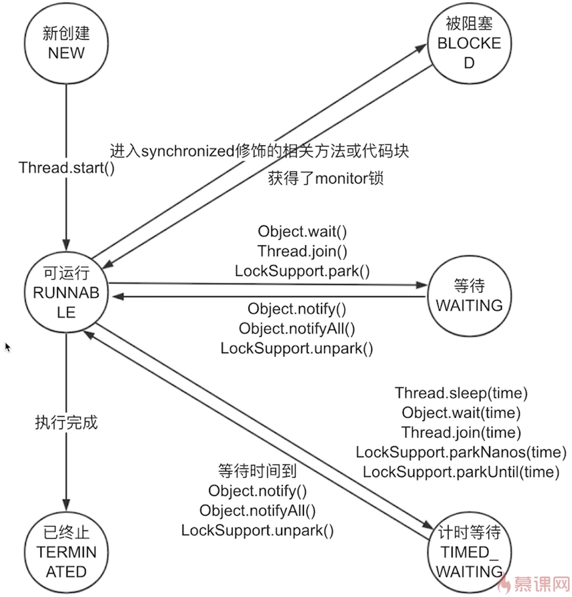

# 线程的生命周期
一句话概括: 记住线程状态转换图
- New
  
  线程已经被创建, 做了一些准备工作, 但是还没有执行start()方法, run()方法还没有被执行过.

- Runnable
  
  一旦调用start()方法后, 线程就从New转化到了Runnable状态, 但是注意, 线程处于Runnable状态时, 并不一定正在执行run()方法, 因为它可能在等待被分配处理器资源. 它对应操作系统对线程的描述的ready和running两种状态.

  同时, 如果一个线程被分配CPU资源得以运行一段时间后又被收回了CPU资源, 那么这个时候这个线程依然是Runnable状态, 这个状态表示这个线程依然 "可以运行",  

- Blocked
  
  当线程执行到被synchronized修饰的代码块并且没有拿到锁的时候, 该线程进入Blocked状态, Blocked只针对synchronized修饰的代码块. 当获得monitor锁的时候, 线程从Blocked回到Runnable

- Waiting
  
  只能从Runnable进入, 进入Waiting状态: Object.wait(), Thread.join(), LockSupport.park().

  只能退出到Runnable, 退出Waiting状态: Object.notify(), Object.notifyall(), LockSupport.unpark()

- Timed_waiting
  
  只能从Runnable进入, 进入Waiting状态: Thread.sleep(), Object.wait(time), Thread.join(time), LockSupport.parkNanos(time), LockSupport.parkUntil(time).

  只能退出到Runnable, 退出Waiting状态: Object.notify(), Object.notifyall(), LockSupport.unpark()

- Terminated
  
  第一种情况: 线程顺利执行完毕, 顺利结束并退出, 资源被回收
  
  第二种情况: 线程抛出了一个没有被补货单异常, 导致run()方法以外被终止.

- 阻塞状态

  Blocked, Waiting, Timed_waiting这三种线程状态统称为阻塞状态.
  比如等待IO操作, 等待锁, 等待从sleep中唤醒过来, 或者等待其他线程的结果.

