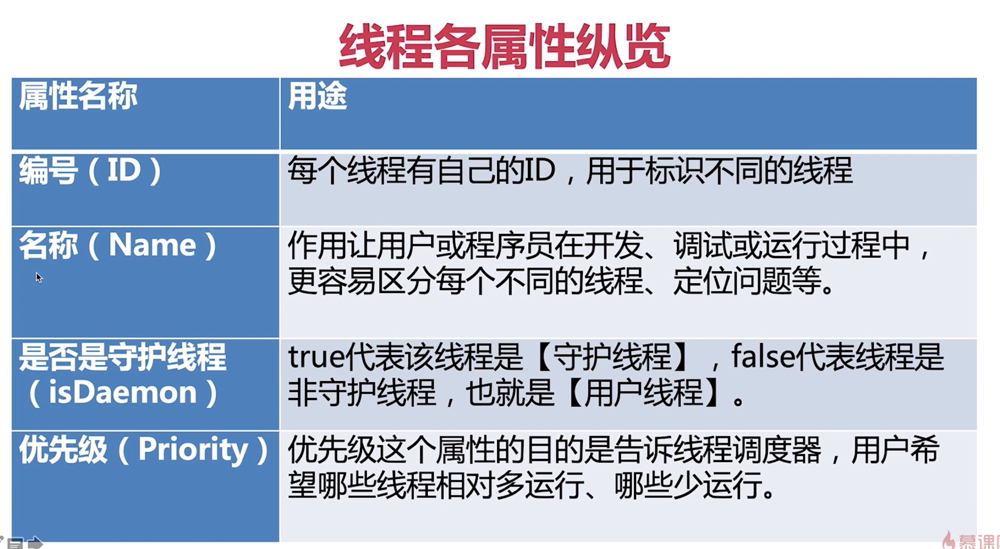

# 线程属性

- id
    1.  主线程id从1开始, 源码中是idSeqNumber先自增然后才返回的
    2. 第一个子线程不是2, 主线程启动后, JVM会启动很多其他的线程, 所以我们创建的子线程的id不是2
-  name
    1.  线程默认的名字是"Thread-" + threadInitNumber, 由JVM创建并自增,synchronize维护的代码块中进行, 保证了这个number的唯一性
    2. 如何修改名字 

- 守护线程 boolean值
    1. 给用户线程提供服务
    2. 守护线程创建的子线程还是守护线程
    3. 用户线程要创建守护线程, 得setDaemon
    4. main线程是JVM创建的用户线程
    5. JVM退出的时候只看是否所有用户线程执行完了没, 不看守护线程
    6. 开发者不应该人为的把自己创建的线程设置为守护线程, 因为JVM如果检测到用户线程执行完, 那就会自动关闭, 但是这个时候如果用自己创建的一个线程是守护线程的话, 那么它不一定能够顺利执行完, 会严重影响业务逻辑.

- 线程优先级
    1. 10个优先级 默认是5, 子线程继承父线程的优先级
    2. 业务开发不应该依赖于优先级, Java的优先级会映射到操作系统的优先级, 操作系统不同, 优先级不同, 可能会造成操作系统不同, 代码运行结果不同
    3. 操作系统会修改优先级, 而且操作系统的调度不全依赖于优先级, 所以业务开发不应该依赖于优先级

