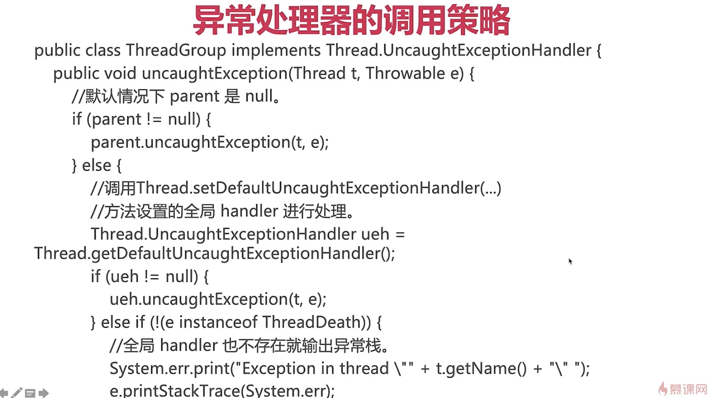

# Java如何处理未捕获的异常

- Java 异常体系图
- 为什么需要UncoughtExceptionHandler
    1. 主线程可以轻松捕获异常, 而子线程却不行
    2. 主线程的try catch 无法捕获子线程run方法中抛出的异常, 因为子线程抛出异常的时候已经在子线程中了
    3. 如果主线程捕获子线程的异常,会提高代码的健壮性
    4. 想要处理子线程抛出的异常, 要么, 就在子线程的代码可能抛出异常的地方用try catch 来捕获, 要么, 就全局使用UncaughtExceptionHandler接口
- UncoughtExceptionHandler
    1. 调用策略见下图
        
    2. 自己实现setDeafultUncaughtExceptionHandler
        - 给程序统一设置: 单独设置一个类实现Thred.UncaughtExceptionHandler, 然后在需要捕获异常的地方设置Thread.setDefaultUncaughtException(new myOwnUncaughtException())
        - 给每个线程单独设置
        - 给线程池设置

# 常见面试问题

1. Java异常体系?
2. 如何处理全局异常, 为什么要处理?
3. run方法是否可以跑出异常, 如果抛出异常, 线程会怎样?
4. 如何处理子线程中未处理的异常?

