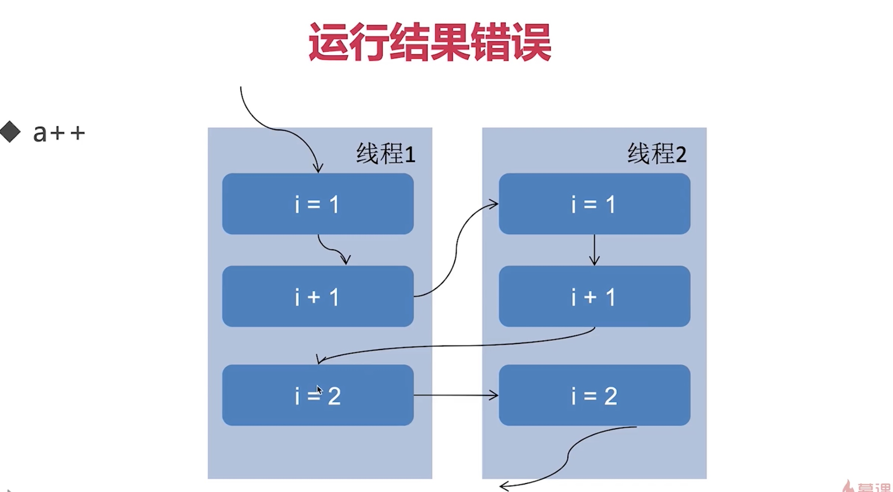

# 线程安全

- 线程安全权威定义
    
1. 当多个线程访问一个对象时, 如果不用考虑这些线程在运行时环境下的调度和执行, 也不需要进行额外的同步, 或者在调用方法上进行任何额外的协调操作, 调用这个对象的行为都可以获得正确的结果, 那么这个对象是线程安全的.
    
        "时间不同, 结果不同"
    
- 线程不安全的典型情况:
    1. 运行结果出错
        - 多个线程对让同一个变量自增, 自增次数少于正确结果, 就是数据库里面的写覆盖, 一个线程的自增操作可以被其他线程打断, 没"commit"之前被其他线程读取了变量a
        
        - 着重分析MultiThreadError.java
        
    2. 活跃性问题

        - 死锁
        - 活锁
        - 饥饿

    3. 对象的发布和初始化的时候的安全问题

        - 什么是发布:

            就是使外部类和对象能够访问这个对象, 比如一个方法的return 值是一个对象, 或者一个对象被作为一个参数传入到了一个方法中.

        - 什么是逸出

            1. 方法返回了一个private成员, 这个成员是个对象

                解决: 返回该成员的副本, 而不是成员本身, 这样的话这个副本被修改也没关系

            2. 还没完成初始化就把对象提供给了外界, 比如:

                - 在构造函数中未初始化完毕就this赋值

                    在多线程的环境中,  一个类或者对象的member在初始化到一半就被另外一个对象访问, 就会拿到一个半成品, 这个是不应该存在的. "时间不同, 结果不同"

                    ```java
                    package background;
                    /**
                     * 描述：     初始化未完毕, 就this赋值
                     */
                    public class MultiThreadsError4 {
                        static Point point;
                        public static void main(String[] args) throws InterruptedException {
                            new PointMaker().start();
                    //        Thread.sleep(10);
                            Thread.sleep(105);
                            if (point != null) {
                                System.out.println(point);
                            }
                        }
                    }
                    
                    class Point {
                        private final int x, y;
                        public Point(int x, int y) throws InterruptedException {
                            this.x = x;
                            MultiThreadsError4.point = this;
                            Thread.sleep(100);
                            this.y = y;
                        }
                    
                        @Override
                        public String toString() {
                            return x + "," + y;
                        }
                    }
                    
                    class PointMaker extends Thread {
                    
                        @Override
                        public void run() {
                            try {
                                new Point(1, 1);
                            } catch (InterruptedException e) {
                                e.printStackTrace();
                            }
                        }
                    }
                    ```

                    

                - 隐式逸出, 即注册监听事件

                    如果在构造函数没有执行完时, 外面的监听器类监听到了某个事件的出发, 从而访问了该类的成员, 那么此时访问的依然是半成品."时间不同, 结果不同"

                - 构造函数中运行线程

                    ```java
                    package background;
                    
                    import java.util.HashMap;
                    import java.util.Map;
                    
                    /**
                     * 描述：     构造函数中新建线程
                     */
                    public class MultiThreadsError6 {
                    
                        private Map<String, String> states;
                    
                        public MultiThreadsError6() {
                            new Thread(new Runnable() {
                                @Override
                                public void run() {
                                    states = new HashMap<>();
                                    states.put("1", "周一");
                                    states.put("2", "周二");
                                    states.put("3", "周三");
                                    states.put("4", "周四");
                                }
                            }).start();
                        }
                    
                        public Map<String, String> getStates() {
                            return states;
                        }
                    
                        public static void main(String[] args) throws InterruptedException {
                            MultiThreadsError6 multiThreadsError6 = new MultiThreadsError6();
                            Thread.sleep(1000);
                            System.out.println(multiThreadsError6.getStates().get("1"));
                        }
                    }
                    
                    ```

                - 解决

                    工厂模式解决监听器造成的隐式逸出, 就是返回一个完全构建好的对象

                    ```java
                    package background;
                    
                    
                    /**
                     * 描述：     用工厂模式修复刚才的初始化问题
                     */
                    public class MultiThreadsError7 {
                    
                        int count;
                        private EventListener listener;
                    
                        private MultiThreadsError7(MySource source) {
                            listener = new EventListener() {
                                @Override
                                public void onEvent(MultiThreadsError5.Event e) {
                                    System.out.println("\n我得到的数字是" + count);
                                }
                    
                            };
                            for (int i = 0; i < 10000; i++) {
                                System.out.print(i);
                            }
                            count = 100;
                        }
                    
                        public static MultiThreadsError7 getInstance(MySource source) {
                            MultiThreadsError7 safeListener = new MultiThreadsError7(source);
                            source.registerListener(safeListener.listener);
                            return safeListener;
                        }
                    
                        public static void main(String[] args) {
                            MySource mySource = new MySource();
                            new Thread(new Runnable() {
                                @Override
                                public void run() {
                                    try {
                                        Thread.sleep(10);
                                    } catch (InterruptedException e) {
                                        e.printStackTrace();
                                    }
                                    mySource.eventCome(new MultiThreadsError5.Event() {
                                    });
                                }
                            }).start();
                            MultiThreadsError7 multiThreadsError7 = new MultiThreadsError7(mySource);
                        }
                    
                        static class MySource {
                    
                            private EventListener listener;
                    
                            void registerListener(EventListener eventListener) {
                                this.listener = eventListener;
                            }
                    
                            void eventCome(MultiThreadsError5.Event e) {
                                if (listener != null) {
                                    listener.onEvent(e);
                                } else {
                                    System.out.println("还未初始化完毕");
                                }
                            }
                    
                        }
                    
                        interface EventListener {
                    
                            void onEvent(MultiThreadsError5.Event e);
                        }
                    
                        interface Event {
                    
                        }
                    }
                    
                    ```

- 各种需要考虑线程安全的情况

    1. 访问共享的变量或者资源, 会有并发的风险, 比如对象的属性, 静态变量, 共享缓存, 数据库等

    2. 所有依赖时序的操作, 即使每一步都是线程安全的, 还是存在线程安全问题

        比如一个线程读取了一段数据, 但是当这个线程希望能够写入这段数据到另外一个地方的时候, 这段数据被另外一个线程修改了, 这段数据其实就已经失效了.

    3. 不同的数据之间存在绑定关系的时候

    4. 我们使用其他类的时候, 如果对方没有声明自己是线程安全的

    