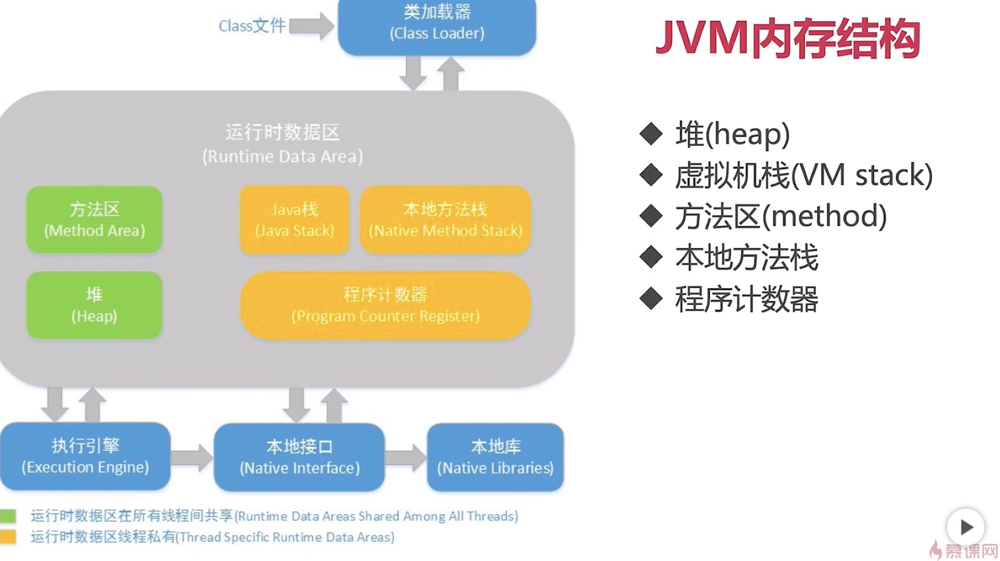
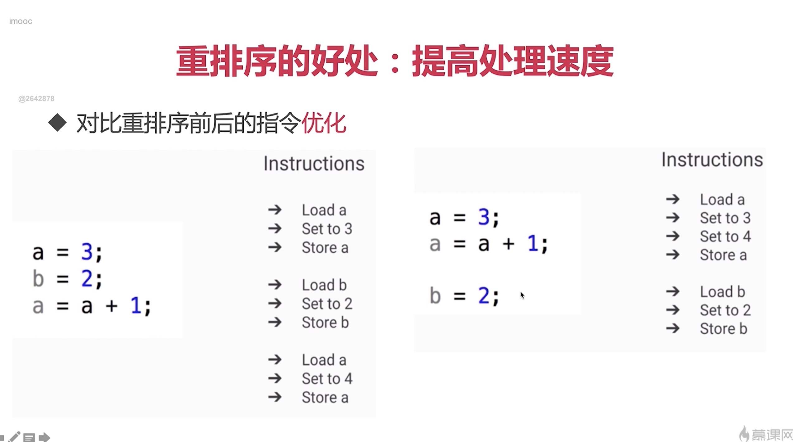
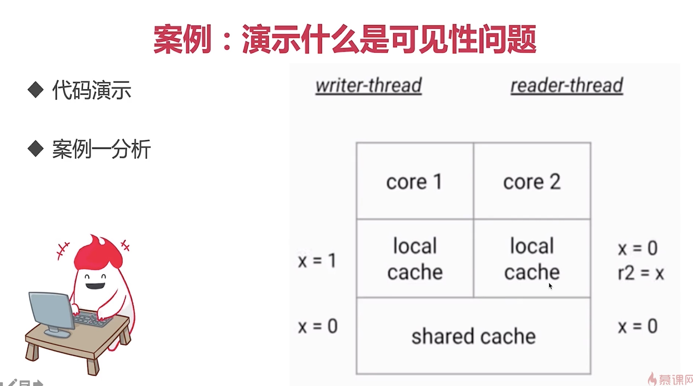
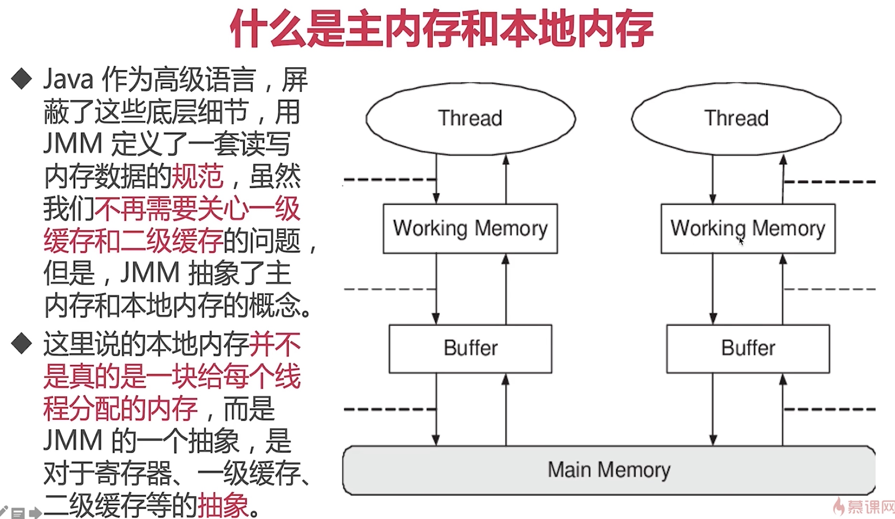
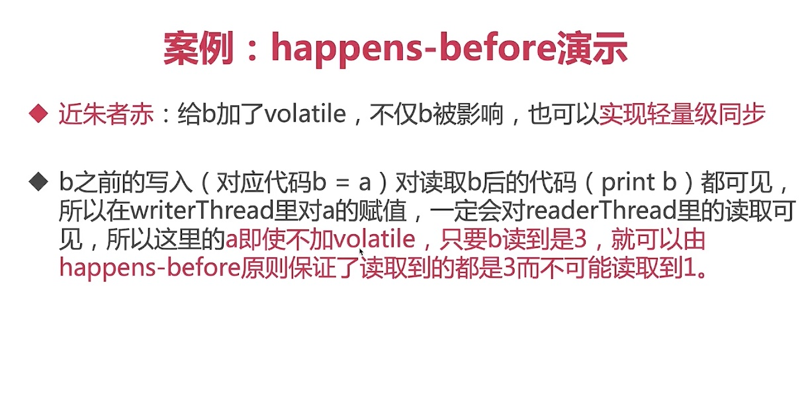

# Java内存模型 JMM

- 区分 JVM内存结构 vs Java内存模型 vs Java对象模型

    1. JVM内存结构

        

    2. Java对象模型

        - Java对象自身的存储模型
        - JVM会给这个类创建一个instanceKlass, 保存在方法区, 用来在JVM层表示该类
        - 我们在Java代码中使用new创建一个对象的时候, JVM会创建一个instanceOopDesc对象, 这个对象中包含了对象头以及实例数据

        

    3. Java内存模型 和并发有关

        - 为什么要JMM: 之前的C语言是没有内存模型的, 完全依靠处理器来和内存直接接触, 不同处理器策略不一样, 所以无法保证并发安全, Java由于要跨平台运行, 需要统一一致的内存管理模型, 来保证并发环境下的程序运行结果一样.
        - 是一组规范, 需要各个JVM的实现来遵守JMM规范, 以便开发者利用这些规范, 开发结果可预期的多线程程序
        - 同时还是各个工具类和一些关键字依赖的原理
        - 最重要的内容: 重排序, 可见性, 原子性

    4. 重排序

        - 概念: 在一个线程内部的两行代码的**实际执行顺序** 和它在**Java文件中的顺序**不一致

        - 好处: 提高处理速度

            

        - 出现重排序的情况:

            1. 编译器的优化: JVM JIT的优化

            2. CPU指令重排

            3. 内存的"重排序": 线程A对数据的修改线程B看不到, 引出可见性问题

                简单来说就是, 在内存中, 写线程更改数据后, 更新的数据还在自己的内存区域内, 还没来得及更新到公共内存区, 这个时候读线程读取该数据, 读到了旧数据, 有点像数据库的"脏读"

                可以使用volatile关键字, 它会将发生更新的数据立刻flush到主内存区, 其实就是高速缓存和内存的数据不一致造成了可见性问题

                

        - JMM对多级高速缓存和寄存器的抽象, 使得开发者不再需要关心具体的计算机的高速缓存情况, 统一的将内存分为"主内存"和"本地内存", 即多级缓存

            

        - JMM规定

            1. 所有的数据以主内存为准, working memary中的内容保存的都是主内存的副本
            2. 线程不能自己修改主内存中的内容, 而是只能修改属于自己的working memary的内容, 改完后再同步到主内存
            3. 线程间只能通过主内存来共享数据

        - happens-before规则

            1. 定义: 就是用来解决可见性问题的, 时间上, 动作A发生在动作B之前, B保证能看见A, 这就是happens-before. 或者说, 如果一个操作happens-before于另一个操作, 那么我们说第一个操作对于第二个操作是可见的

            2. 具体规则

                1. 单线程规则

                    在同一个线程内的代码, 后面的代码一定能看到前面的代码, 也就是说, 后面的代码一定能够拿到前面代码执行的结果, 数据修改了的话, 后面的代码访问到的是最新的数据. 注意, 这一点和重排序不矛盾, 因为这个规则要求的是无论是否发生了重排序, 后面的代码都能看到前面代码执行的结果

                2. 锁操作

                    两个线程, 线程A先加锁完成一些事情, 然后解锁, 然后线程B获得锁. 那么要求线程B在加锁之后能够看到线程A解锁之前的所有内容

                3. volatile

                    如果一个变量被volatile修饰的话, 线程B立马看到线程A把volatile变量修改后的值

                4. 线程启动

                    子线程启动后, 它能看到主线程在启动它那一行代码以上的所有结果

                5. 线程join

                    子线程.join()后, 主线程会等待子线程执行完后再继续执行, 那么子线程应该在执行期间能够看到主线程目前为止所有数据的最新结果

                6. 传递性

                    如果hb(A, B), hb(B, C), 那么hb(A, C)

                7. 中断

                    如果一个线程被中断, 那么其他线程应该能够在该线程被中断后去检测这个线程状态的时候, 发现这线程被中断

                8. 工具类的Happens-Before原则

                    1. 线程安全的容器get的时候, 一定能看到在此之前的put的结果
                    2. CountDownLatch
                    3. Semaphore
                    4. 线程池
                    5. CyclicBarrier
                    6. Future

                9. volatile的巧用

                    

