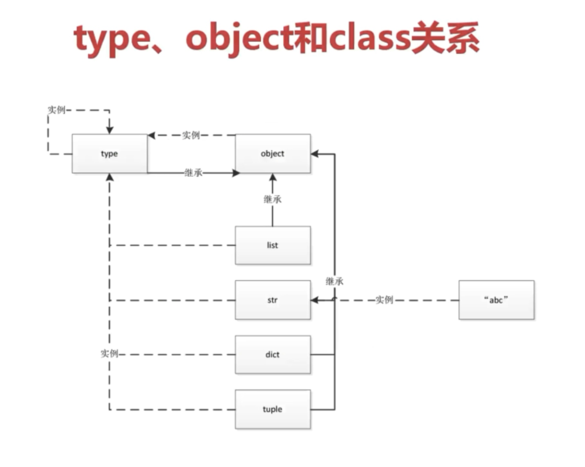

# type,object,class的关系

    a = 1
    b = "abc"
    print(type(1))
    print(type(int))
    print(type(b))
    print(type(str))
    '''
    Terminal:
    <class 'int'>
    <class 'type'>
    <class 'str'>
    <class 'type'>
    '''

    class Student:
        pass

    stu = Student()
    print(type(stu))
    print(type(Student))  # 任何一个类都被看作type的一个实例
    print(int.__bases__)
    print(str.__bases__)
    print(Student.__bases__)
    print(type.__bases__)
    print(object.__bases__)  # object 不继承任何类
    print(type(object))
    '''
    Terminal:
    <class '__main__.Student'>
    <class 'type'>
    (<class 'object'>,)
    (<class 'object'>,)
    (<class 'object'>,)
    (<class 'object'>,)
    ()
    <class 'type'>
    '''

1. 从**继承关系**的角度来看
    所有的类以及各个类实例化的实例都是`object`的子类
    **object从继承的角度是**最顶层的概念

2. 从**一切皆对象**的角度看
    所有的内置类型(`int, str`), 类(`Student, Object`), 这些抽象概念在python中,都被看作 type 的实例, 为了概念的封闭性, type是自己的实例
    **type从实例化的角度是**最顶层的概念**

    当然, 类的实例(`1, "abc", student = Student()`) 也就理所应当的被看作"实例(Student类)的实例".

    这里唯一的特殊点在于**类被type看作实例**, 从而由type统一了起来.