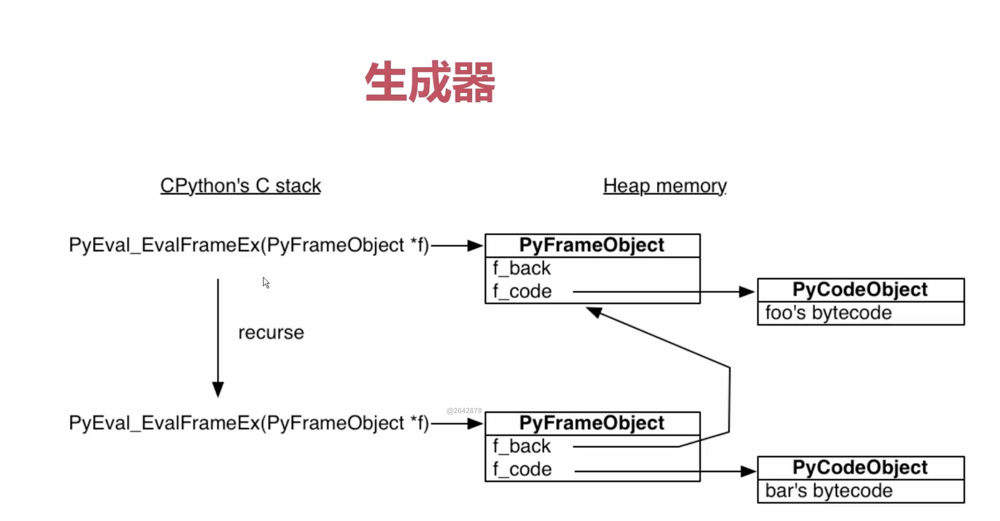
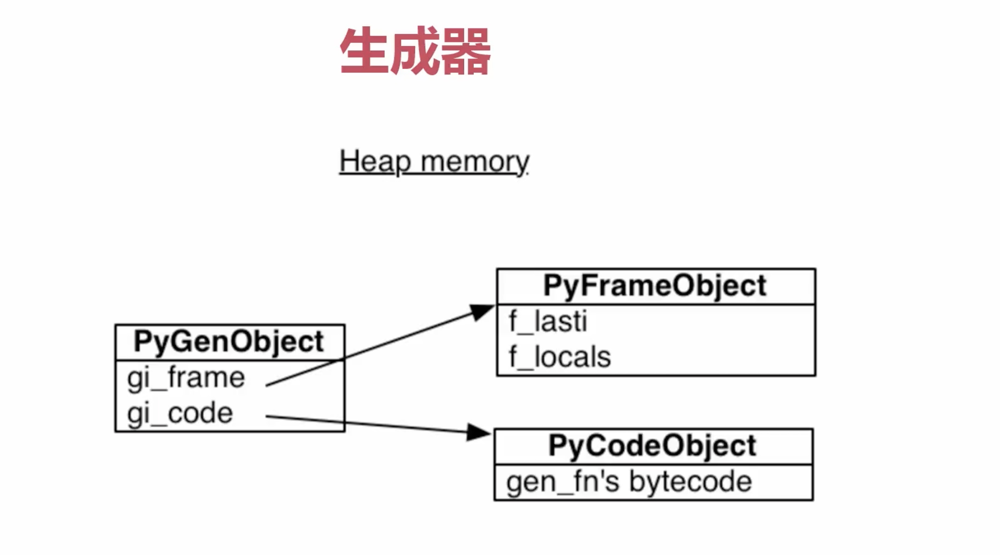

# 迭代器和生成器

## Iterator和Iterable
1. 区分迭代器和可迭代对象的原则是：
   - 具有 `__iter__()` 方法的对象称为可迭代对象. 该方法可获取其迭代器对象.
   - 具有 `__iter__()` 方法和 `__next__()` 方法的对象称为迭代器对象. 该方法能够自动返回下一个结果, 当到达序列结尾时, 引发 StopIteration 异常.


2. 迭代对象本身不一定是迭代器, 但可以通过其 `__iter__()` 方法得到对应的迭代器对象.
定义可迭代对象, 必须实现 `__iter__()` 方法；定义迭代器, 必须实现 `__iter__()` 和 `__next__()`方法.

3. 对于可迭代对象, 可以使用`iter()` 函数得到其对应的迭代器对象, 使用`next()` 函数获取该迭代器对象当前返回的元素.
```python
l = [1, 2, 3]
iterName=iter(l)
print(iterName)
print(next(iterName))
print(next(iterName))
print(next(iterName))
print(next(iterName))

'''
>>> l = [1, 2, 3]
>>> iterName=iter(l)
>>> print(iterName)
<list_iterator object at 0x0000017D355F8D00>
>>> print(next(iterName))
1
>>> print(next(iterName))
2
>>> print(next(iterName))
3
>>> print(next(iterName))
Traceback (most recent call last):
  File "<stdin>", line 1, in <module>
    print(next(iterName))
StopIteration
'''
```
可见, `iter()` 函数与 `__iter__()` 方法联系非常紧密, `iter()` 是直接调用该对象的`__iter__()` 方法, 并将其返回结果作为自己的返回值, `next()`函数则是调用该对象的 `__next__()` 方法获取当前元素. 上例中在得到列表l最后一个元素3后再一次使用了`next( )`函数, 而此时列表l中已经没有可获取的元素了, 所以抛出了异常.

因此, 通俗地说, 可以将迭代器简单理解为"内置了 for 循环的可迭代对象", 每使用 next( ) 函数访问一次迭代器对象, 其在返回当前元素的同时, 内部指针将指向下一个元素.

注意:
  1. 迭代器只能往前走, 不能往回走
  2. 迭代器不需要实现`__getitem__()`, 这个是实现切片的魔法函数


## 定义自己的迭代器
```python
from collections.abc import Iterator


class Company(object):
    def __init__(self, employee_list):
        self.employee = employee_list

    def __iter__(self):
        return MyIterator(self.employee)


class MyIterator(Iterator):
    def __init__(self, employee_list):
        self.iter_list = employee_list
        self.index = 0

    def __next__(self):
        try:
            word = self.iter_list[self.index]
        except IndexError:
            raise StopIteration
        self.index += 1
        return word


if __name__ == "__main__":
    company = Company(["tom", "bob", "jane"])
    my_itor = iter(company)
    while True:
        try:
            print(next(my_itor))
        except StopIteration:
            pass  
```
  

## 生成器函数的使用

函数中只要有`yield`关键字就是一个**生成器函数**
```python

def fib(index):
    if index <= 2:
        return 1
    else:
        return fib(index-1) + fib(index-2)


def fib2(index):
    re_list = []
    n, a, b = 0, 0, 1
    while n < index:
        re_list.append(b)
        a, b = b, a+b
        n += 1
    return re_list


def gen_fib(index):
    n, a, b = 0, 0, 1
    while n < index:
        yield b
        a, b = b, a+b
        n += 1


if __name__ == "__main__":
    for data in gen_fib(10):
        print(data)
```

## 生成函数的原理
初步了解, 待进一步学习



```python
#1.python中函数的工作原理
"""

"""
import inspect
frame = None
def foo():
    bar()
def bar():
    global frame
    frame = inspect.currentframe()

#python.exe会用一个叫做 PyEval_EvalFramEx(c函数)去执行foo函数,  首先会创建一个栈帧(stack frame)
"""
python一切皆对象, 栈帧对象,  字节码对象
当foo调用子函数 bar,  又会创建一个栈帧
所有的栈帧都是分配在堆内存上, 这就决定了栈帧可以独立于调用者存在
"""
# import dis
# print(dis.dis(foo))

foo()
print(frame.f_code.co_name)
caller_frame = frame.f_back
print(caller_frame.f_code.co_name)


def gen_func():
    yield 1
    name = "bobby"
    yield 2
    age = 30
    return "imooc"

import dis
gen = gen_func()
print (dis.dis(gen))

print(gen.gi_frame.f_lasti)
print(gen.gi_frame.f_locals)
next(gen)
print(gen.gi_frame.f_lasti)
print(gen.gi_frame.f_locals)
next(gen)
print(gen.gi_frame.f_lasti)
print(gen.gi_frame.f_locals)

class company:
    def __getitem__(self, item):
        pass

from collections import UserList


```

