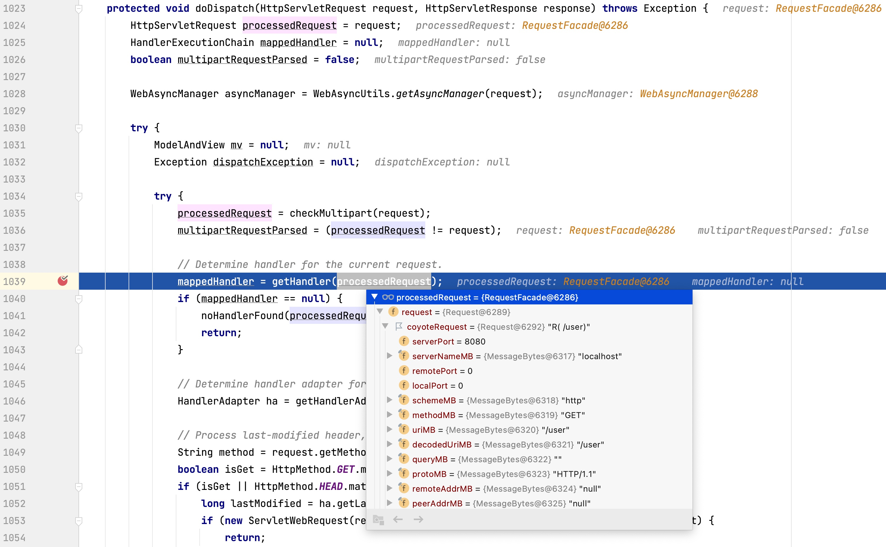
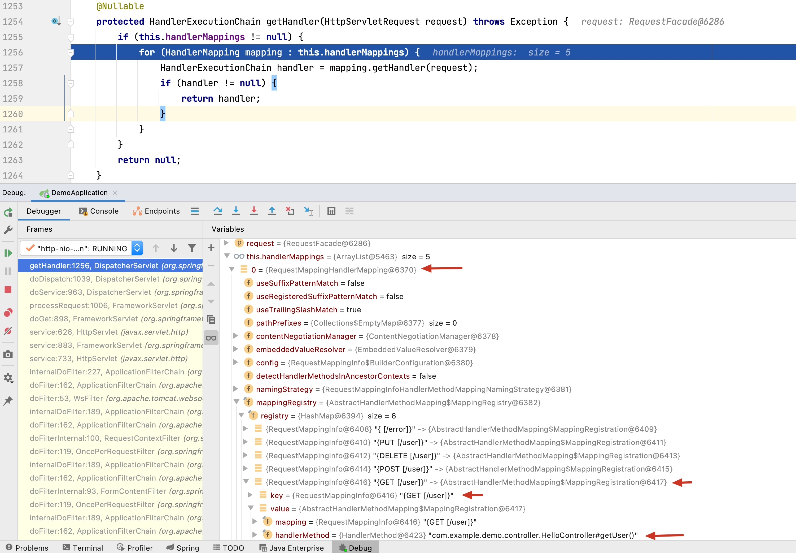

# 源码跟踪 - DispatcherServlet解析请求路径并且映射到具体controller方法的过程

## 场景描述
SpringMVC的最核心的一个servlet就是`DispatcherServlet`, 根据其源码中对这个Servlet的描述
>Central dispatcher for HTTP request handlers/controllers, e.g. for web UI controllers or HTTP-based remote service exporters. Dispatches to registered handlers for processing a web request, providing convenient mapping and exception handling facilities.

它的一个首要功能就是完成从 **请求** 到 **controller**(就是指controller中的每个具体的method)的映射.

## 单步跟踪
下面以一个最简单的 `GET /user`为例子 跟踪涉及到的源码 看看`DispatcherServlet`具体是怎么完成这个映射过程的.

1. 一个 `HttpServletRequest request`被`DispatcherServlet`的`doDispatch()`捕获 完成最初始的检查和初始化工作, 然后该`request`被传入`getHandler()`. 
2. 在`getHandler()`中, 可以看到Spring初始化了5个`handlerMappings`(个人称之为映射关系组), 每一个`handlerMappings`其实都对应一组映射关系, 但是目前就我学习到的知识, 我们在controller中写的由`@RequestMapping()`注解负责的映射关系都在第0个中.可以看到其中的`mappingRegistry -> registry -> {GET [/user]}`这个`RequestMappingInfo`对象的key就是 **请求路径**, value是一个对象,其中包含 **对应controller中的对应method**, 在这里是`getUser()`
3. 后面的处理就非常直接明了了, 一旦找到一个符合的method就返回给1039行的`mappedHandler` 后续的过程就是下面的处理了.

## 小结
到此 一个完成的请求处理过程中的**请求映射**部分就完成了, 可以看到, SpringMVC的映射也是用HashMap来完成的, 一层层剥开后其实并不复杂, 但是更多内容类似Adaptor contextManager等等还有待于继续学习

1. 后面遇到问题时, 单步调试可以看`DispatcherServlet.java`的`doDispatch()`方法. 这样可以跟踪这个请求映射过程, 也可以看看是否我们从其他地方发过来的请求在DispatcherServlet中如我们所料, 对应的method是否正是我们希望的.

    
