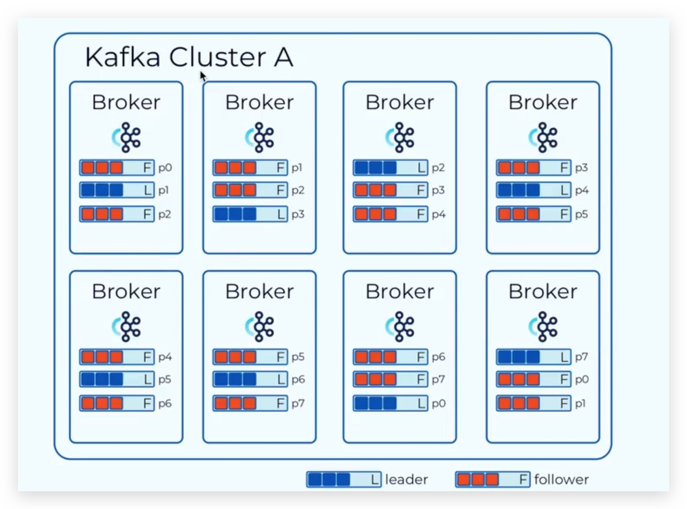

# Kafka

## 基本概念



- Event / Record 消息
- Topic 话题
- Broker 消息中介 比如在一个物理机器上启动一个broker, 多个broker构成简单的集群
- Partition 分区 将一个topic中的所有消息分成几个部分, 比如 [event_1, event_2, event_3] 和 [event_4, event_5, event_6]. 分区中的消息没有重叠.
- Replication-factor 副本因子 指一个分区中的消息在物理上存储了几份, 如 replication-factor = 2 就表示存储了两份, 这两份副本内容上是一摸一样的, 分别存储在两台不同的物理机器上. 一般多个副本中, 会有一个leader, 其余为follower, broker只对leader进行读写, follower纯粹为了数据备份用.
- Consumer Group 将消费者分组 分区是最小的并行单位, 一个消费者可以消费多个分区里的消息, 一个分区里的消息可以被多个消费者组里的消费者消费, 但是, 一个分区不能同时被同一个消费者组里的多个消费者消费.

## 消息传递语义

基本机制:

    生产者给 broker 发送消息, broker 成功收到消息后会给生产者发送一个 notification

    消费者向 broker 申请消费消息, 消费者成功收到消息后, 会给 broker 发送一个 notification

1. 最多一次 消息可能会丢失, 永远不重复发送

    生产者: 只发送一次消息, 无论是否发送成功. 无论是发送失败, 还是接受 notification 的过程失败, 都不重新发送消息

        ```java
            props.put("acks", 0);
            // or
            props.put("acks", 1);
            // https://docs.confluent.io/platform/current/installation/configuration/producer-configs.html#acks
        ```

    消费者: 只消费一次消息, 无论是否消费消息成功, offset 往后移动一位: 消费者向 broker 先提交 offset movement, 然后再消费消息, 消息可能没有成功到达消费者, 但是消费者不会请求再次消费这个信息

2. 最少一次 消息不回丢失, 但是可能会重复发送

    生产者: 会一直发送消息, 直到成功收到该消息的 notification. 可能重复发送了该消息, 比如: 第一次成功发送了消息, 但是没有成功收到notification, 那么就会启动第二次的发送

        ```java
            props.put("acks", "all");
            // and
            props.put("retries", 5);
            // https://docs.confluent.io/platform/current/installation/configuration/producer-configs.html#acks
        ```

    消费者: 会一直接受消息, 知道成功接受到该消息后, 才会提交 offset movement 给 broker

3. 精确一次 保证消息被传递到服务端且在服务端不会重复

## Stream API
